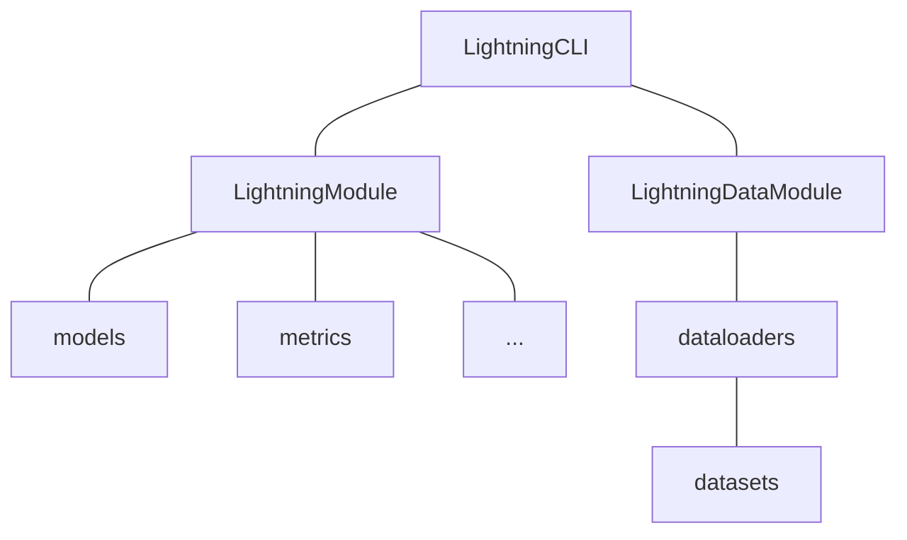

# Streaming Vocos: Neural vocoder for fast streaming applications
Vocos was proposed as fast neural vocoder designed to synthesize audio waveforms from acoustic features.
This repo replicates the design as the origial vocos archiecture but modified to have an streaming implementation.
So all the vanilla CNNs are replaced with causal CNNs and modified to work in streaming settings with dynmically adjustable chunk size (in multiples of hop size of 320ms).

What makes vocos different from other typical GAN-based vocoders is that Vocos does not model audio samples in the time domain. Instead, it generates spectral coefficients, facilitating rapid audio reconstruction through inverse Fourier transform. This cuts down the processing time significantly and is very appropriate for streaming applications that require minimal latency.


Training follows the Generative Adversarial Network (GAN) objective as original but loss functions are changed to those proposed in the descript audio codec (see [repo](https://github.com/descriptinc/descript-audio-codec)).

Visit our [demo website (coming soon)]() for audio samples.

Refer below for original paper and audio samples.
[Audio samples](https://gemelo-ai.github.io/vocos/) |
Paper [[abs]](https://arxiv.org/abs/2306.00814) [[pdf]](https://arxiv.org/pdf/2306.00814.pdf)


## Checkpoints
Coming soon

## Usage

### Installation

```bash
# Clone project
git clone https://github.com/warisqr007/vocos.git 
cd vocos

# [Optional] Create a conda virtual environment
conda create -n <env_name> python=3.10
conda activate <env_name>

# [Optional] Use mamba instead of conda to speed up
conda install mamba -n base -c conda-forge

# Install dependencies
pip install -r requirements.txt
```

### Data Preprocessing
We follow the same data-processing stage as [here](https://github.com/PSI-TAMU/streamVC). Please follow directions in the specified repo.


### Run

**Fit**

```bash
python src/main.py fit -c configs/data/resynthesis.yaml -c configs/model/vocosvocoder.yaml --trainer.logger.name debug
```

**Resume**

```bash
python src/main.py fit -c configs/data/resynthesis.yaml -c configs/model/vocosvocoder.yaml --ckpt_path <ckpt_path> --trainer.logger.id exp1_id
```


### Inference

See [notebooks/inference.ipynb](notebooks/inference.ipynb)


### Project Architecture



### File Structure

```text
├── configs                  # Configuration files
│   ├── data                 # Dataset configuration
│   │   └── mnist.yaml       # Example configuration for MNIST dataset
│   ├── model                # Model configuration
│   │   └── simplenet.yaml   # Example configuration for SimpleNet model
│   └── default.yaml         # Default configuration
├── data                     # Dataset directory
├── logs                     # Log directory
├── notebooks                # Jupyter Notebook directory
├── scripts                  # Script directory
│   └── clear_wandb_cache.py # Example script to clear wandb cache
├── src                      # Source code directory
│   ├── callbacks            # Callbacks directory
│   │   └── __init__.py
│   ├── data_modules         # Data module directory
│   │   ├── __init__.py
│   │   └── mnist.py         # Example data module for MNIST dataset
│   ├── metrics              # Metrics directory
│   │   └── __init__.py
│   ├── models               # Model directory
│   │   ├── __init__.py
│   │   └── simplenet.py     # Example SimpleNet model
│   ├── modules              # Module directory
│   │   ├── __init__.py
│   │   └── mnist_module.py  # Example MNIST module
│   ├── utils                # Utility directory
│   │   ├── __init__.py
│   │   └── cli.py           # CLI tool
│   ├── __init__.py
│   └── main.py              # Main program entry point
├── .env.example             # Example environment variable file
├── .gitignore               # Ignore files for git
├── .project-root            # Project root indicator file for pyrootutils
├── LICENSE                  # Open source license
├── pyproject.toml           # Configuration file for Black and Ruff
├── README.md                # Project documentation
├── README_PROJECT.md        # Project documentation template
├── README_ZH.md             # Project documentation in Chinese
└── requirements.txt         # Dependency list
```

### Configuration

1. Define dataset by inheriting `pl.LightningDataModule` in `src/data_module`.
2. Define dataset configuration file in `configs/data` as parameters for the custom `pl.LightningDataModule`.
3. Define the model by inheriting `nn.Module` in `src/models`.
4. Define metrics by inheriting `torchmetrics.Metric` in `src/metrics`.
5. Define training module by inheriting `pl.LightningModule` in `src/modules`.
6. Define the configuration file for the training module in `configs/model` as parameters for the custom `pl.LightningModule`.
7. Configure `pl.trainer`, logs and other parameters in `configs/default.yaml`.

## Tips

### `print_config`

Using the `print_config` functionality of `jsonargparse`, you can obtain the parsed arguments and generate default `yaml` files. However, it is necessary to first configure the `yaml` files for `data` and `model`.

```bash
python src/main.py fit -c configs/data/mnist.yaml -c configs/model/simplenet.yaml --print_config
```

[Prepare a config file for the CLI](https://lightning.ai/docs/pytorch/stable/cli/lightning_cli_advanced.html#prepare-a-config-file-for-the-cli)

### Customized `LightningCLI`

This template implements a custom `CLI` (`CustomLightningCLI`) to achieve the following functions,

- When starting the program, the configuration file is automatically saved to the corresponding log directory, for `WandbLogger` only.
- When starting the program, save configurations for optimizer and scheduler to loggers.
- When starting the program, the default configuration file is automatically loaded.
- After the test is completed, the `checkpoint_path` used for testing is printed.
- Add some command line parameters:
    - `--ignore_warnings` (default: `False`): Ignore all warnings.
    - `--test_after_fit` (default: `False`): Automatically test after each training.
    - `--git_commit_before_fit` (default: `False`): `git commit` before each training, the commit message is `{logger.name}_{logger.version}`, for `WandbLogger` only.

[CONFIGURE HYPERPARAMETERS FROM THE CLI (EXPERT)](https://lightning.ai/docs/pytorch/stable/cli/lightning_cli_expert.html)

### Limit `numpy` number of threads

When running on a server, especially when the CPU has a lot of cores (>=24), you may encounter the problem of too many `numpy` processes, which may cause the experiment to inexplicably hang. You can limit the number of `numpy` processes by setting environment variables (in the `.env` file).

```text
OMP_NUM_THREADS=8
MKL_NUM_THREADS=8
GOTO_NUM_THREADS=8
NUMEXPR_NUM_THREADS=8
OPENBLAS_NUM_THREADS=8
MKL_DOMAIN_NUM_THREADS=8
VECLIB_MAXIMUM_THREADS=8
```

> `.env` file is automatically loaded to environment by [`pyrootutils`](https://github.com/ashleve/pyrootutils) via [`python-dotenv`](https://github.com/theskumar/python-dotenv).

[Stack Overflow: Limit number of threads in numpy](https://stackoverflow.com/questions/30791550/limit-number-of-threads-in-numpy)

### Clear `wandb` cache

When you delete an experiment from the `wandb` web page, the cache of the experiment still exists in the local `wandb` directory, you can use the `scripts/clear_wandb_cache.py` script to clear the cache.

[Wandb Python Documentation](https://docs.wandb.ai/ref/python/)


## Acknowledgements
- [Vocos Repo](https://github.com/gemelo-ai/vocos)
- [Moshi Repo for streaming implementation](https://github.com/kyutai-labs/moshi)
- [lightning-template](https://github.com/DavidZhang73/pytorch-lightning-template)
